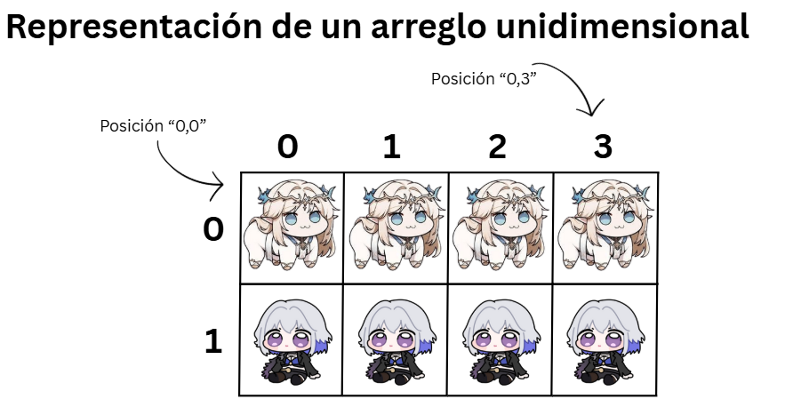
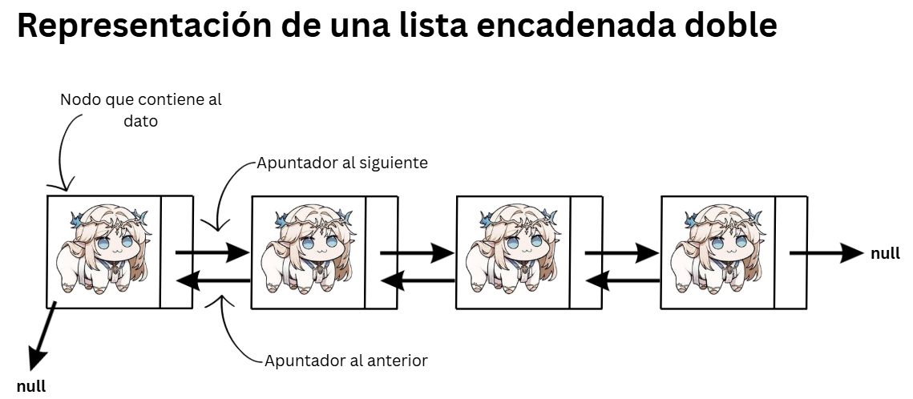
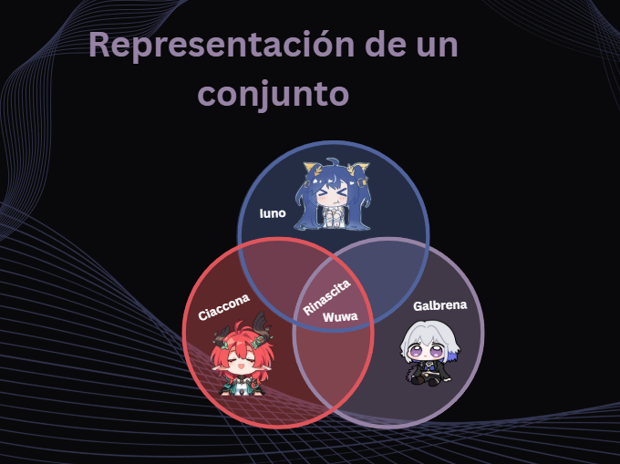

# Estructuras de datos
Las estructuras de datos más comunes son:  
#### **Lineales**
- Arreglos
    - Unidimensionales
    - Bidimensionales
- Pilas
- Colas
- Listas encadenadas
    - Simples
    - Dobles
    - Circulares
#### **No Lineales**
- Arboles binarios de búsqueda
- Gráfos
#### **Abstractas**
- Diccionarios
- Conjuntos

## Arreglos
Un arreglo es una estructura de datos que almacena un conjunto de elementos del mismo tipo en ubicaciones contiguas de memoria. Permite acceder a cada elemento mediante un índice numérico, lo que facilita la manipulación de grandes volúmenes de información.  

Los arreglos son fundamentales en muchas aplicaciones de software y se utilizan para:
- Almacenar grandes volúmenes de datos de manera eficiente.
- Optimizar el rendimiento de algoritmos de búsqueda y ordenamiento.
- Manejar datos en estructuras más complejas como grafos y listas enlazadas.
- Facilitar el procesamiento de imágenes y señales en inteligencia artificial.  

### Esta es una representación de un arreglo **unidimensional**  

### Los datos se llaman elementos del arreglo y se enumeran consecutivamente 0, 1, 2, 3, etc. El tipo de elementos almacenados en el arreglo puede ser de cualquier tipo de dato. Normalmente el arreglo se utiliza para almacenar tipos como double, int , char. 
``` C#
Arreglo[] unArreglo = new Arreglo[tamaño];
```
### Arreglo Bidimensional  

### Al igual que los arreglos de una dimensión, los arreglos bidimensionales también pueden ser creados como los **vectores**, pero pasando como argumentos una lista con las filas de la matriz:
``` c#
Arreglo[] unArreglo = new Arreglo[fila,columna];
```

## Pilas
Es una estructura de datos **lineal** que sigue el principio de **LIFO**  
donde el último elemento que se agregó es el primero en salir.
- Las inserciones y eliminaciones solo ocurren en un extremo, la cima de la pila.
- Puede ser implementada utilizando arreglos o listas encadenadas.
### Operaciones Comunes:
- Push() - Agregar un elemento a la pila
- Pop() - Sacar un elemento de la pila
- Peek() - Ver el último elemento de la pila
- EstáVacia() - Verificar si la pila está vacia


## Colas
Es una estructura lineal caracterizada por una secuencia de  
elemento en la que la operación de inserción se realiza por  
un extremo y la extracción por el otro. Sigue el principio de  
**FIFO**, donde el primer elemento en entrar es el primero en salir.
- Tiene dos operaciones básicas
    - Encolar() - Añade un elemento a la cola
    - Desencolar() - Elimina el elemento de la cola
- Solo se puede acceder al primer elemento para su eliminación y al último
para su inserción
- Generalmente se implementa con una lista encadenada
- Utiliza dos punteros, uno para el frente y otro para el final  


## Listas Encadenadas
Es una estructura de datos lineal que almacena elementos en nodos
interconectados, donde cada nodo contiene un dato y un puntero que lleva al
siguiente o al anterior.  
### Componentes:
- Nodo: cada elemento individual de la lista
- Dato: la información que almacena el nodo
- Apuntador: La referencia que lleva al siguiente nodo de la lista
- Cabeza: el primer nodo de la lista
- Null: el último nodo de la lista apunta a null, indicando el fin de la lista
### **Tipos de listas**
### Simples 
Cada nodo solo tiene un puntero que lleva al siguiente de la lista.


### Dobles
Cada nodo tiene dos punteros: uno que lleva al anterior y otro al siguiente, permitiendo el recorrido en ambas direcciones.  
El **ANTERIOR** del primero apunta a **null** y el **SIGUIENTE** del último
igual.


### Circulares
El último nodo de la lista apunta al primero, creando un ciclo que se 
puede recorrer infinitamente.


## Arboles Binarios de Busqueda
#### Es una estructura de datos en la que cada nodo tiene dos subárboles: el izquierdo, con valores menores, y el derecho, con valores mayores que la clave del nodo. Esta propiedad hace que las operaciones de búsqueda, inserción y eliminación sean eficientes, ya que permite un acceso rápido a los datos.  

### Características:
- Estructura: Cada nodo puede tener como máximo dos hijos, uno izquierdo y uno derecho. 
- Propiedad de ordenación: Para cualquier nodo:
- Todos los valores en el subárbol izquierdo son menores que el valor del nodo. 
- Todos los valores en el subárbol derecho son mayores que el valor del nodo. 
- Subárboles: Ambos subárboles (izquierdo y derecho) deben cumplir también la propiedad de árbol binario de búsqueda. 
- Comparables: Los elementos insertados deben ser comparables, lo que significa que debe existir una relación de orden (menor que, mayor que) entre ellos.

### Operaciones Comunes:
- Búsqueda: Para buscar un elemento, se compara con el nodo raíz. Si es menor, se busca en el subárbol izquierdo; si es mayor, se busca en el subárbol derecho. 
- Inserción: Se busca la posición donde debería estar el nuevo elemento siguiendo las mismas reglas de búsqueda, y luego se inserta el nodo allí. 
- Eliminación: El proceso es más complejo, ya que depende de si el nodo a eliminar tiene 0, 1 o 2 hijos.  


### El hijo derecho se vuelve un **subarbol** donde él es la raíz

## Grafos
#### Los grafos en programación son estructuras de datos compuestas por nodos (o vértices) y aristas (o arcos) que conectan pares de nodos, usados para modelar relaciones entre conjuntos de datos. A diferencia de los árboles, los grafos pueden tener ciclos y las aristas pueden ser dirigidas, bidireccionales o tener un peso numérico que representa un valor (como distancia o costo). 

### Componentes Principales:
- Nodos (o vértices): Son las entidades o puntos en el grafo. Pueden representar cualquier cosa, desde una ubicación en un mapa hasta usuarios en una red social o una página web. 
- Aristas (o arcos): Son las conexiones entre dos nodos. 
    - Aristas dirigidas: Tienen una dirección específica (ej. de A a B, pero no de B a A). 
    - Aristas no dirigidas: Se pueden recorrer en ambas direcciones (ej. de A a B y de B a A). 
    - Aristas ponderadas: Tienen un valor numérico (peso) asociado, como el costo de un viaje entre dos ciudades.
### Aplicaciones Comunes:
- Redes sociales: Modelar amistades entre usuarios. 
- Mapas y rutas: Encontrar la ruta más corta entre dos puntos (algoritmo de Dijkstra). 
- Redes sociales: Encontrar el grado de separación entre dos personas. 
- Navegación GPS: Mostrar la ruta más corta entre dos puntos. 
- Análisis de redes: Detectar anomalías o amenazas en redes de TI. 
- Algoritmos de búsqueda: Explorar un conjunto de nodos (ej. Búsqueda en Profundidad - DFS, Búsqueda en Anchura - BFS).


## Diccionario
#### Son estructuras de datos en programación que almacenan información en pares clave-valor, donde cada clave única se utiliza para acceder al valor asociado. Son ideales para organizar y recuperar datos de manera eficiente, ya que permiten un acceso rápido a los elementos sin tener que recorrer toda la estructura. Se crean usando llaves {} y pueden contener diferentes tipos de datos.

### Características:
- Pares clave-valor: Cada elemento está compuesto por una clave y un valor. 
- Claves únicas e inmutables: Las claves deben ser únicas dentro de un diccionario y no pueden ser modificadas (son inmutables, como las tuplas o cadenas). Si se repite una clave, se reemplaza el valor anterior. 
- Valores modificables: Los valores pueden ser de cualquier tipo de dato y pueden ser modificados. 
- Sin orden predefinido: Los diccionarios no mantienen un orden específico de los elementos. 
- Múltiples tipos de datos: Pueden almacenar elementos de diversos tipos.

A diferencia de otras estructuras que se acceden por un índice númerico, 
los diccionarios se acceden mediante claves definidas por el programador.
### Aplicaciones:
- Representar objetos: Son ideales para almacenar información estructurada de un objeto, como los detalles de un libro (título, autor, año). 
- Contar la frecuencia: Se usan para contar la frecuencia de elementos en una colección, por ejemplo, cuántas veces aparece una palabra en un texto. 
- Gestión de inventario: Permiten organizar y buscar eficientemente información de inventario, como los libros de una tienda online. 


## Conjunto
#### Es una estructura de datos que almacena elementos únicos y desordenados. Es análogo a un conjunto matemático, pero en informática se implementa para realizar operaciones de manera eficiente, como buscar si un elemento está presente o eliminar duplicados. A diferencia de otras colecciones como las listas, los conjuntos no tienen un orden específico y no permiten elementos repetidos. 
### Características de un conjunto:
- Elementos únicos: Un conjunto no **permite elementos duplicados**. Si intentas añadir un elemento que ya existe, el conjunto permanecerá sin cambios. 
- No ordenado: Los elementos **no tienen un orden fijo**. El orden en que se agregan los elementos no se preserva; {'a', 'b', 'c'} es el mismo conjunto que {'c', 'a', 'b'}. 
- Mutable: En muchos lenguajes, los conjuntos son **mutables**, lo que significa que se pueden modificar después de su creación. 
- Eficiencia: Son muy **eficientes para operaciones** como verificar si un elemento pertenece al conjunto y para eliminar duplicados de otras colecciones. 
### ¿Qué usos tiene?
- Para eliminar duplicados: Puedes convertir una lista en un conjunto para obtener solo sus elementos únicos y luego volver a convertirla en lista si es necesario. 
- Para realizar operaciones de conjuntos: Permiten llevar a cabo operaciones matemáticas como la unión, intersección y diferencia de manera muy eficiente. 
- Para verificar pertenencia: Es una forma rápida de comprobar si un elemento existe dentro de una colección. 
- Para agrupar datos únicos: Se usan cuando necesitas almacenar un grupo de datos, pero no te interesa el orden y quieres asegurarte de que no haya repeticiones.  


